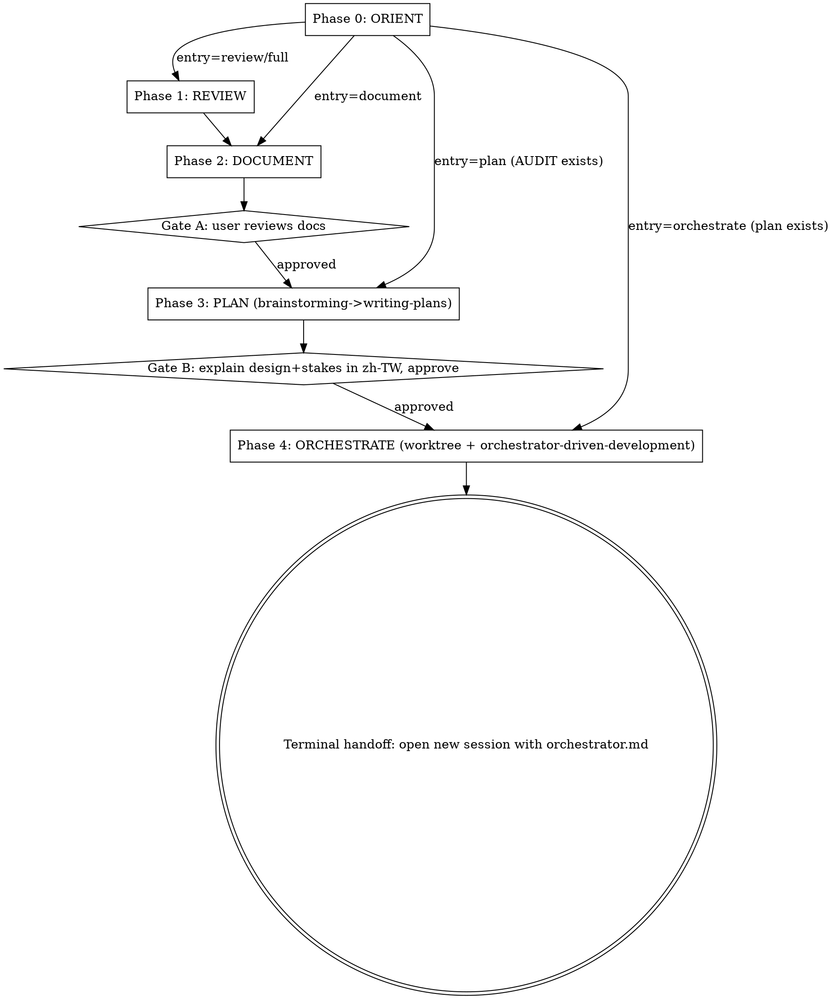

## Overview

This is a **conductor skill**. It drives a project-maintenance cycle by invoking existing sub-skills at phase boundaries — it does NOT re-implement them. It detects the current cycle state, enters at the right phase, enforces approval gates, and makes cross-session handoffs explicit.

---

## Operating Rules

- You are a conductor. Invoke sub-skills via the Skill tool at phase boundaries; pass each one the right artifact. Never duplicate a sub-skill's internal logic.
- Always run **Phase 0 ORIENT** first, unless the user explicitly names an entry phase.
- Honor every gate. **Gate A** and **Gate B** require explicit user approval in this conversation before the next phase runs; the **terminal handoff** means you stop and hand off to a new session, never continue inline. No exceptions — do not skip a gate for any reason (e.g. "user already said OK", "no changes needed", "saves a round-trip").
- Cross-session boundaries (`ultra` review, orchestrator launch) are **explicit handoffs** — never run them inline/automatically.
- Reply to the user in **Traditional Chinese** (per their global CLAUDE.md).
- Run one phase at a time; after each phase, state what happened and what the next phase is.

---

## Phase State Machine

| Phase | Name | Action | Delegate-to / Tools | Gate |
|---|---|---|---|---|
| 0 | **ORIENT** | Detect current state, confirm parameters, decide entry point | `AskUserQuestion` | — |
| 1 | **REVIEW** | Run code-review, extract findings | `code-review` skill (Skill tool; `ultra` exception: stop and hand off to user) | — |
| 2 | **DOCUMENT** | Write findings into `AUDIT.md`/`BACKLOG.md`/`ROADMAP.md` + update `README.md`/`CLAUDE.md` | `maintaining-project-docs` skill | **Gate A: user reviews docs** |
| 3 | **PLAN** | Start design from "fix all findings in AUDIT.md" → write plan | `brainstorming` → `writing-plans` skills | **Gate B: explain design + stakes in zh-TW, then approve** (brainstorming HARD-GATE) |
| 4 | **ORCHESTRATE** | Create worktree + generate orchestrator session files | `using-git-worktrees` + `orchestrator-driven-development` skills | **Terminal handoff: instruct user to open new session with `` `orchestrator.md` ``** |

### Session Boundary Breakpoints

The cycle has two natural session breakpoints; the conductor MUST handle these as explicit handoffs, never inline:

- **Breakpoint 1 (conditional):** When `effort=ultra`, code-review runs asynchronously in the cloud → conductor stops, instructs user to run `/code-review ultra <scope>` themselves, then resume from Phase 2 with the results.
- **Breakpoint 2 (mandatory):** The orchestrator must start in a fresh session → the conductor's terminal action is a handoff instruction, not an inline launch.

### Control Flow

**Skip-entry and gates:** When Phase 0 routes you to a later entry phase, gates for the phases you skipped are treated as already satisfied (e.g. entering at PLAN because a fresh `AUDIT.md` exists means Gate A — doc review — was satisfied in a prior cycle). Gates for phases you DO run still fire normally: entering at PLAN still requires **Gate B** before ORCHESTRATE; entering at ORCHESTRATE assumes Gate B was already passed when the plan was written.

---

## Phase 0 — ORIENT

### (a) Detection Scan

> `scope` may already be known from the invocation arguments (e.g. `/project-maintenance-cycle strategies/grid-trader`). If so, scan `<scope>/`; otherwise scan project-wide (whole project is the default) and let the entry-phase proposal account for what was found.

Run these commands to snapshot the project state before asking the user anything:

| Signal | Command |
| --- | --- |
| PR / branch | `git branch --show-current` ; `gh pr view --json number,state 2>/dev/null` |
| AUDIT exists | `find . -maxdepth 3 -name AUDIT.md -not -path '*/.*' 2>/dev/null` (if scope is known, also `test -f <scope>/AUDIT.md`) |
| AUDIT fresh | `[ "$(stat -c %Y AUDIT.md)" -gt "$(git log -1 --format=%ct -- . ':!docs/' ':!*.md' 2>/dev/null)" ] && echo FRESH \|\| echo STALE` — "fresh" means AUDIT.md's mtime is newer than the latest non-doc commit. Freshness is a heuristic — the conductor states its FRESH/STALE verdict to the user in the Phase 0 AskUserQuestion prompt and lets the user confirm. When in doubt, treat AUDIT.md as authoritative (the no-overwrite rule protects it). |
| existing plan | `ls docs/plans/*.md 2>/dev/null` |
| orchestrator setup | `test -f docs/sessions/orchestrator.md` ; `git worktree list` |

Map results to a proposed entry phase:

- **No AUDIT, no plan** → propose **REVIEW** (full cycle).
- **Fresh AUDIT exists, no plan** → propose **PLAN** (do NOT re-run review; do NOT overwrite AUDIT — confirm first).
- **Plan exists, no orchestrator files** → propose **ORCHESTRATE**.
- **Orchestrator files exist** → tell the user a prior cycle is already set up; instruct them to open a new Claude Code session with `docs/sessions/orchestrator.md` to resume it — then stop.

### (b) Parameter Collection via AskUserQuestion

Collect all parameters in a single `AskUserQuestion` prompt. Entry phase (derived from the detection scan above) is question 1; include the remaining questions only as needed:

| Parameter | Default | Notes |
| --- | --- | --- |
| `scope` | whole project | Path or "whole project" |
| `effort` | `max` | `low` / `medium` / `high` / `max`; `ultra` must be explicitly requested by the user — never assume it as a default. It runs asynchronously in the cloud (billed); the conductor cannot launch it and must hand off (see Phase 1). |
| `--fix` | **OFF** | Apply fixes inline during review |
| `--comment` | **ON if PR detected, else OFF** | Post findings as inline PR comments |
| `phases` | derived from detection | Subset of REVIEW / DOCUMENT / PLAN / ORCHESTRATE. Only override the detection-derived entry when the user wants a specific subset (e.g. DOCUMENT only). Otherwise follow the proposed entry phase. |

> **Never overwrite a fresh `AUDIT.md` silently.** If a fresh `AUDIT.md` exists and the user did not explicitly request re-review, propose entering at **PLAN** (reuse it). AUDIT.md may be regenerated ONLY when the user actively chooses re-review — never as a routine default.
