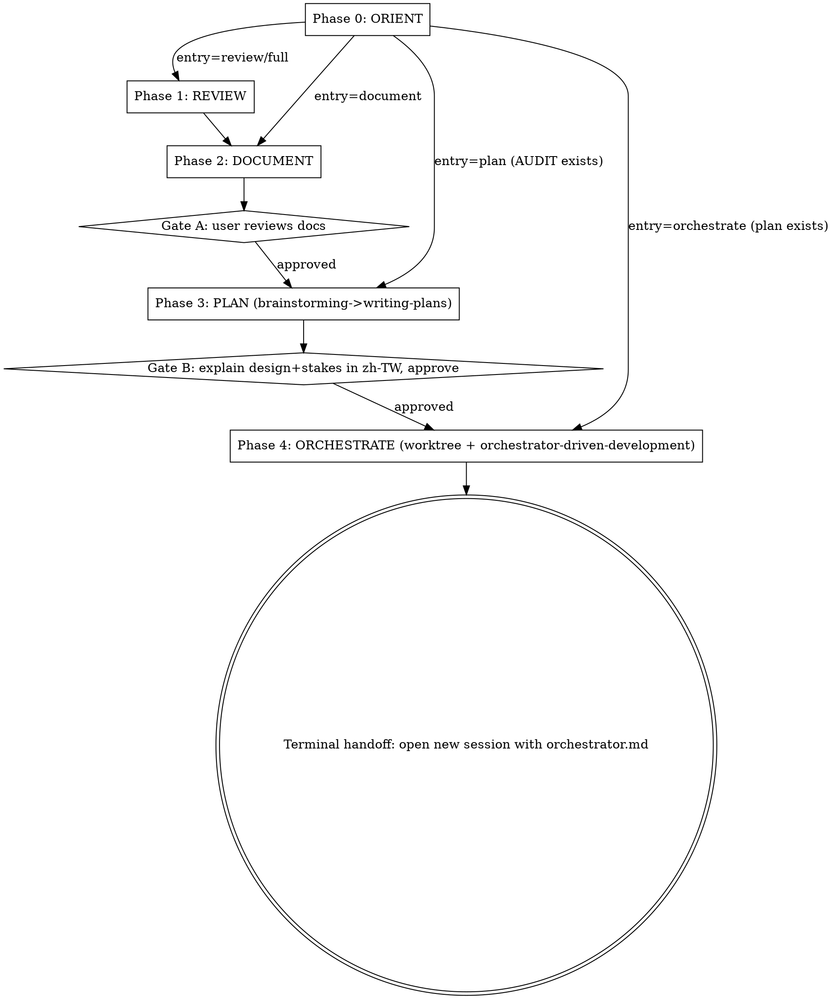

## Overview

This is a **conductor skill**. It drives a project-maintenance cycle by invoking existing sub-skills at phase boundaries — it does NOT re-implement them. It detects the current cycle state, enters at the right phase, enforces approval gates, and makes cross-session handoffs explicit.

---

## Operating Rules

- You are a conductor. Invoke sub-skills via the Skill tool at phase boundaries; pass each one the right artifact. Never duplicate a sub-skill's internal logic.
- Always run **Phase 0 ORIENT** first, unless the user explicitly names an entry phase.
- Honor **every gate** (Gate A, Gate B, terminal handoff). Never skip a gate to "save a round-trip."
- Cross-session boundaries (`ultra` review, orchestrator launch) are **explicit handoffs** — never run them inline/automatically.
- Reply to the user in **Traditional Chinese** (per their global CLAUDE.md).
- Run one phase at a time; after each phase, state what happened and what the next phase is.

---

## Phase State Machine

| Phase | Name | Action | Delegate-to / Tools | Gate |
|---|---|---|---|---|
| 0 | **ORIENT** | Detect current state, confirm parameters, decide entry point | `AskUserQuestion` | — |
| 1 | **REVIEW** | Run code-review, extract findings | `code-review` skill (Skill tool; `ultra` exception: stop and hand off to user) | — |
| 2 | **DOCUMENT** | Write findings into `AUDIT/BACKLOG/ROADMAP` + update `README/CLAUDE` | `maintaining-project-docs` skill | **Gate A: user reviews docs** |
| 3 | **PLAN** | Start design from "fix all findings in AUDIT.md" → write plan | `brainstorming` → `writing-plans` skills | **Gate B: explain design + stakes in zh-TW, then approve** (brainstorming HARD-GATE) |
| 4 | **ORCHESTRATE** | Create worktree + generate orchestrator session files | `using-git-worktrees` + `orchestrator-driven-development` skills | **Terminal handoff: instruct user to open new session with `orchestrator.md`** |

### Session Boundary Breakpoints

The cycle has two natural session breakpoints; the conductor MUST handle these as explicit handoffs, never inline:

- **Breakpoint 1 (conditional):** When `effort=ultra`, code-review runs asynchronously in the cloud → conductor stops, instructs user to run `/code-review ultra <scope>` themselves, then resume from Phase 2 with the results.
- **Breakpoint 2 (mandatory):** The orchestrator must start in a fresh session → the conductor's terminal action is a handoff instruction, not an inline launch.

### Control Flow

