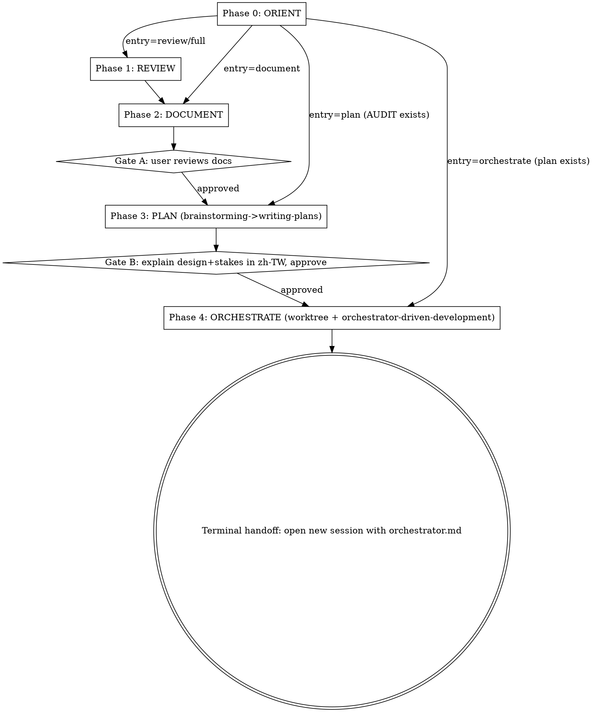

## Overview

This is a **conductor skill**. It drives a project-maintenance cycle by invoking existing sub-skills at phase boundaries — it does NOT re-implement them. It detects the current cycle state, enters at the right phase, enforces approval gates, and makes cross-session handoffs explicit.

---

## Operating Rules

- You are a conductor. Invoke sub-skills via the Skill tool at phase boundaries; pass each one the right artifact. Never duplicate a sub-skill's internal logic.
- Always run **Phase 0 ORIENT** first, unless the user explicitly names an entry phase.
- Honor every gate. **Gate A** and **Gate B** require explicit user approval in this conversation before the next phase runs; the **terminal handoff** means you stop and hand off to a new session, never continue inline. No exceptions — do not skip a gate for any reason (e.g. "user already said OK", "no changes needed", "saves a round-trip").
- Cross-session boundaries (`ultra` review, orchestrator launch) are **explicit handoffs** — never run them inline/automatically.
- Reply to the user in **Traditional Chinese** (per their global CLAUDE.md).
- Run one phase at a time; after each phase, state what happened and what the next phase is.

---

## Phase State Machine

| Phase | Name | Action | Delegate-to / Tools | Gate |
|---|---|---|---|---|
| 0 | **ORIENT** | Detect current state, confirm parameters, decide entry point | `AskUserQuestion` | — |
| 1 | **REVIEW** | Run code-review, extract findings | `code-review` skill (Skill tool; `ultra` exception: stop and hand off to user) | — |
| 2 | **DOCUMENT** | Write findings into `AUDIT.md`/`BACKLOG.md`/`ROADMAP.md` + update `README.md`/`CLAUDE.md` | `maintaining-project-docs` skill | **Gate A: user reviews docs** |
| 3 | **PLAN** | Start design from "fix all findings in AUDIT.md" → write plan | `brainstorming` → `writing-plans` skills | **Gate B: explain design + stakes in zh-TW, then approve** (brainstorming HARD-GATE) |
| 4 | **ORCHESTRATE** | Create worktree + generate orchestrator session files | `using-git-worktrees` + `orchestrator-driven-development` skills | **Terminal handoff: instruct user to open new session with `` `orchestrator.md` ``** |

### Session Boundary Breakpoints

The cycle has two natural session breakpoints; the conductor MUST handle these as explicit handoffs, never inline:

- **Breakpoint 1 (conditional):** When `effort=ultra`, code-review runs asynchronously in the cloud → conductor stops, instructs user to run `/code-review ultra <scope>` themselves, then resume from Phase 2 with the results.
- **Breakpoint 2 (mandatory):** The orchestrator must start in a fresh session → the conductor's terminal action is a handoff instruction, not an inline launch.

### Control Flow



**Skip-entry and gates:** When Phase 0 routes you to a later entry phase, gates for the phases you skipped are treated as already satisfied (e.g. entering at PLAN because a fresh `AUDIT.md` exists means Gate A — doc review — was satisfied in a prior cycle). Gates for phases you DO run still fire normally: entering at PLAN still requires **Gate B** before ORCHESTRATE; entering at ORCHESTRATE assumes Gate B was already passed when the plan was written.

---

## Phase 0 — ORIENT

### (a) Detection Scan

> `scope` may already be known from the invocation arguments (e.g. `/project-maintenance-cycle strategies/grid-trader`). If so, scan `<scope>/`; otherwise scan project-wide (whole project is the default) and let the entry-phase proposal account for what was found.

Run these commands to snapshot the project state before asking the user anything:

| Signal | Command |
| --- | --- |
| PR / branch | `git branch --show-current` ; `gh pr view --json number,state 2>/dev/null` |
| AUDIT exists | `find . -maxdepth 3 -name AUDIT.md -not -path '*/.*' 2>/dev/null` (if scope is known, also `test -f <scope>/AUDIT.md`) |
| AUDIT fresh | Compare AUDIT.md mtime vs the latest non-doc commit — see freshness check below |
| existing plan | `ls docs/plans/*.md 2>/dev/null` |
| orchestrator setup | `test -f docs/sessions/orchestrator.md` ; `git worktree list` |

**Freshness check** — "fresh" means AUDIT.md's mtime is newer than the latest non-doc commit:

```bash
if [ "$(stat -c %Y AUDIT.md)" -gt "$(git log -1 --format=%ct -- . ':!docs/' ':!*.md' 2>/dev/null)" ]; then echo FRESH; else echo STALE; fi
```

Freshness is a heuristic — the conductor states its FRESH/STALE verdict to the user in the Phase 0 `AskUserQuestion` prompt and lets the user confirm. When in doubt, treat AUDIT.md as authoritative (the no-overwrite rule protects it).

Map results to a proposed entry phase:

- **No AUDIT, no plan** → propose **REVIEW** (full cycle).
- **Fresh AUDIT exists, no plan** → propose **PLAN** (do NOT re-run review; do NOT overwrite AUDIT — confirm first).
- **Plan exists, no orchestrator files** → propose **ORCHESTRATE**.
- **Orchestrator files exist** → tell the user a prior cycle is already set up; instruct them to open a new Claude Code session with `docs/sessions/orchestrator.md` to resume it — then stop.

### (b) Parameter Collection via AskUserQuestion

Collect all parameters in a single `AskUserQuestion` prompt. Entry phase (derived from the detection scan above) is question 1; include the remaining questions only as needed:

| Parameter | Default | Notes |
| --- | --- | --- |
| `scope` | whole project | Path or "whole project" |
| `effort` | `max` | `low` / `medium` / `high` / `max`; `ultra` must be explicitly requested by the user — never assume it as a default. It runs asynchronously in the cloud (billed); the conductor cannot launch it and must hand off (see Phase 1). |
| `--fix` | **OFF** | Apply fixes inline during review |
| `--comment` | **ON if PR detected, else OFF** | Post findings as inline PR comments |
| `phases` | derived from detection | Subset of REVIEW / DOCUMENT / PLAN / ORCHESTRATE. Only override the detection-derived entry when the user wants a specific subset (e.g. DOCUMENT only). Otherwise follow the proposed entry phase. |

> **Never overwrite a fresh `AUDIT.md` silently.** If a fresh `AUDIT.md` exists and the user did not explicitly request re-review, propose entering at **PLAN** (reuse it). AUDIT.md may be regenerated ONLY when the user actively chooses re-review — never as a routine default.

---

## Phase 1 — REVIEW

### Standard effort (`effort ∈ {low, medium, high, max}`)

Invoke the `code-review` skill via the Skill tool, passing the effort level and scope:

```
/code-review <effort> <scope>
```

Include flags collected in Phase 0:

- `--comment` if a PR was detected (or the user requested it)
- `--fix` if the user opted in

Capture the findings output. If the findings are large (more than ~50 lines), stash them to `./.pmc-findings.md` (a gitignored scratch file — keep it out of git) and carry the path forward; otherwise keep them in context.

After the review completes, state: what effort level was used, what scope was covered, and how many findings were captured. Then proceed to Phase 2.

### Ultra effort (`effort = ultra`) — Breakpoint 1 (cross-session handoff)

**STOP. Do NOT invoke the review yourself.**

`ultra` runs asynchronously in the cloud, is billed, and is **user-triggered only — you cannot launch it.** Tell the user verbatim (substitute the actual scope from Phase 0 for `<scope>`):

> 請您自己在終端機執行：
>
> `/code-review ultra <scope>`
>
> 等 ultra review 完成後，將結果複製貼到這個對話，然後繼續 Phase 2 — DOCUMENT。

Do not proceed to Phase 2 until the user returns with the ultra-review output.

---

## Phase 2 — DOCUMENT

Invoke the `maintaining-project-docs` skill via the Skill tool. Pass the findings by appending them to the instruction string — inline if short, or as a file reference (e.g. `@./.pmc-findings.md`) if you stashed them in Phase 1. Instruction template:

> `update README.md/CLAUDE.md for <scope> and create AUDIT.md/BACKLOG.md/ROADMAP.md for the findings.` followed by the findings content or file reference.

After the skill completes and any changed files are committed:

### Gate A (mandatory)

Present a concise summary of every file written or modified (file path + one-line description of change). Then wait. The user must **explicitly approve in this conversation** (any clear affirmative they type — e.g. 「approved」/「OK, 繼續」) before Phase 3 runs. No implicit approval counts: a prior verbal OK earlier in the turn, 「no changes needed」, or your own judgement that the docs look fine do NOT satisfy Gate A.

> 以上文件請確認後，回覆「approved」才進行 Phase 3 — PLAN。

---

## Phase 3 — PLAN

Invoke the `brainstorming` skill via the Skill tool with the idea: `fix all findings in AUDIT.md`.

### Gate B — Design + zh-TW stakes explanation (mandatory, pre-implementation)

Before `brainstorming` begins any design work, explicitly require the following convention:

> 先用繁體中文詳細解釋設計決策與 stakes，approve 後才寫 spec/plan。

This means: explain all design decisions and their stakes in Traditional Chinese in detail; only write the spec/plan after the user explicitly approves the direction. `brainstorming`'s built-in HARD-GATE already enforces no-implementation-before-approval; Gate B adds the language and stakes requirement on top of it.

After `brainstorming` completes and the user has approved the design direction, invoke the `writing-plans` skill via the Skill tool. After `writing-plans` completes (it produces `docs/plans/YYYY-MM-DD-<feature>.md` and offers execution options), if the user selects the orchestrator-driven execution option, proceed to **Phase 4**. Otherwise the cycle ends here.

---

## Phase 4 — ORCHESTRATE

### Step 1 — Create a worktree

**REQUIRED SUB-SKILL:** invoke `using-git-worktrees` via the Skill tool to create an isolated worktree for this implementation cycle. Then ensure the active working directory is INSIDE that worktree before invoking `orchestrator-driven-development`, so its `docs/sessions/` and `.claude/agents/` output resolves within the worktree (not the original branch).

### Step 2 — Generate session files

Invoke `orchestrator-driven-development` via the Skill tool. It generates the orchestrator session files under `docs/sessions/` and subagent definitions under `.claude/agents/`, then commits them (see `references/phase-contracts.md` for the exact output structure).

### Terminal handoff — Breakpoint 2 (mandatory cross-session handoff)

**STOP. Do NOT attempt to run the orchestrator inline.**

Instruct the user to open a new session and paste `docs/sessions/orchestrator.md` as the initial prompt. Tell the user:

> Phase 4 完成。請開啟一個全新的 Claude Code session，並將以下檔案的內容貼入作為第一則訊息：
>
> `docs/sessions/orchestrator.md`
>
> 不要在這個 session 繼續執行 orchestrator — 它必須在全新 session 中啟動。conductor 的工作至此結束，請勿在本 session 繼續任何操作。

---

## Red Flags

Each row is a rationalization the conductor must reject — the thought on the left, the rule that counters it on the right.

| Thought | Reality |
|---|---|
| "There's no AUDIT.md so I can skip Phase 0 and go straight to REVIEW" | Phase 0 ORIENT is mandatory unless the user explicitly names an entry phase. |
| "An AUDIT.md is already here, I'll regenerate it" | Don't overwrite a fresh AUDIT. Ask; default to reusing it (enter at PLAN). |
| "I'll just kick off the ultra review for them" | `ultra` is cloud + billed + user-triggered only. STOP and hand off. |
| "Add `--fix` so it's faster" | `--fix` defaults OFF. Fixes are planned deliberately in Phase 3. |
| "Docs look fine, skip Gate A" | Gate A is mandatory: requires an explicit typed affirmative AFTER the doc summary is shown — not your judgement that the docs look fine. |
| "I'll explain the design in English to save time" | Gate B requires Traditional Chinese + stakes before approval. |
| "I'll run the orchestrator in this session" | Orchestrator needs a fresh session. Generate files, then hand off. |
| "Let me restate what code-review/maintaining-project-docs does" | Don't re-implement or describe sub-skill logic inline — invoke via the Skill tool and defer detail to `references/phase-contracts.md`. |
| "The user already approved earlier in this turn — that counts" | Any gate requires an explicit affirmative typed AFTER the phase output is shown. Earlier agreement does not satisfy a later gate. |

---

## Integration

Sub-skills this conductor depends on, listed by phase:

- **REQUIRED SUB-SKILL (Phase 1):** the built-in `code-review` skill — invoke via `Skill tool` with effort and scope; do not re-implement review logic here.
- **REQUIRED SUB-SKILL (Phase 2):** `maintaining-project-docs` — invoke via `Skill tool` to write `AUDIT.md`, `BACKLOG.md`, `ROADMAP.md`, and update `README.md`/`CLAUDE.md`.
- **REQUIRED SUB-SKILL (Phase 3):** `brainstorming` → `writing-plans` — invoke in sequence via `Skill tool`; `brainstorming` must complete with Gate B approval before `writing-plans` begins.
- **REQUIRED SUB-SKILL (Phase 4):** `using-git-worktrees` (create the worktree first) + `orchestrator-driven-development` (generate session files inside the worktree).

For exact invocation contracts and artifacts of each sub-skill, see `references/phase-contracts.md`.
