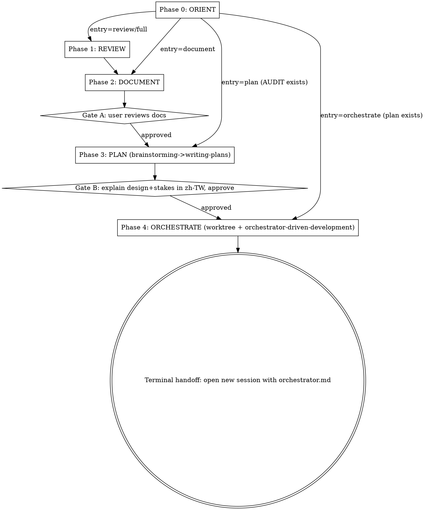

# project-maintenance-cycle Implementation Plan

> **For agentic workers:** REQUIRED SUB-SKILL: Use superpowers:subagent-driven-development (recommended) or superpowers:executing-plans to implement this plan task-by-task, or superpowers:orchestrator-driven-development for a stateful, resumable multi-session pipeline.

**Goal:** Author a discipline-enforcing conductor skill that drives the project-maintenance cycle (ORIENT → REVIEW → DOCUMENT → PLAN → ORCHESTRATE) by invoking existing sub-skills at phase boundaries, with smart phase detection, mandatory gates, and explicit cross-session handoffs.

**Architecture:** The skill is a documentation artifact — `SKILL.md` (the conductor logic: operating rules, phase state machine, Phase 0 detection decision tree, gates, cross-session handoff, red flags) plus `references/phase-contracts.md` (precise invocation contracts and artifacts of each sub-skill). The skill does NOT re-implement any sub-skill; it invokes `/code-review`, `maintaining-project-docs`, `brainstorming`→`writing-plans`, and `using-git-worktrees`+`orchestrator-driven-development` via the Skill tool at the right moments. After authoring, the skill is installed via symlink into `~/.claude/skills/` and validated with subagent scenarios.

**Tech Stack:** Markdown + YAML frontmatter (Claude Code skill format). Git for versioning. Subagents (Agent tool / Task tool) for validation.

**Source of truth:** `docs/superpowers/specs/2026-06-17-project-maintenance-cycle-design.md` (read it before starting). All section references below (§N) point into that spec.

**Working directory:** `/home/cy/Code/LLMDev/skills/project-maintenance-cycle` (a fresh git repo on `main`; spec already committed at `e6b2a52`).

**Language rule:** SKILL.md and reference files are instructions for Claude → **English** (per user global CLAUDE.md: code/identifiers/log/instruction prose in English). The spec doc is project documentation and may stay Traditional Chinese. Chat replies to the user are Traditional Chinese.

---

### Task 1: SKILL.md — frontmatter, overview, operating rules, phase state machine

**Files:**
- Create: `SKILL.md`

**Implementation:**

Write the top of the conductor skill. Four blocks in order.

**(a) Frontmatter** — verbatim:

```yaml
---
name: project-maintenance-cycle
description: Use when running a project maintenance cycle on a project or scope — code review, then document findings (AUDIT/BACKLOG/ROADMAP), then plan fixes, then orchestrate implementation. Detects current cycle state and enters at the right phase; supports partial runs (review-only, document-only, plan-from-existing-AUDIT). Conductor that invokes code-review, maintaining-project-docs, brainstorming/writing-plans, and orchestrator-driven-development.
---
```

**(b) Overview** (2–3 sentences): This is a **conductor skill**. It drives a project-maintenance cycle by invoking existing sub-skills at phase boundaries — it does NOT re-implement them. It detects the current cycle state, enters at the right phase, enforces approval gates, and makes cross-session handoffs explicit.

**(c) Operating rules** (a short bullet list Claude must obey):
- You are a conductor. Invoke sub-skills via the Skill tool at phase boundaries; pass each one the right artifact. Never duplicate a sub-skill's internal logic.
- Always run **Phase 0 ORIENT** first, unless the user explicitly names an entry phase.
- Honor **every gate** (Gate A, Gate B, terminal handoff). Never skip a gate to "save a round-trip."
- Cross-session boundaries (`ultra` review, orchestrator launch) are **explicit handoffs** — never run them inline/automatically.
- Reply to the user in **Traditional Chinese** (per their global CLAUDE.md).
- Run one phase at a time; after each phase, state what happened and what the next phase is.

**(d) Phase state machine** — reproduce the table from spec §4 (Phase 0 ORIENT / 1 REVIEW / 2 DOCUMENT / 3 PLAN / 4 ORCHESTRATE, with the delegate-to column and gate column), then add this dot graph for the control flow:



**Verification:**

Run: `head -5 SKILL.md | grep -q '^name: project-maintenance-cycle' && echo FRONTMATTER_OK`
Expected: `FRONTMATTER_OK`

Run: `grep -cE 'Phase 0: ORIENT|Phase 4: ORCHESTRATE' SKILL.md`
Expected: `>= 2`

**Commit:**
```bash
git add SKILL.md
git commit -m "feat: add conductor frontmatter, operating rules, and phase state machine"
```

---

### Task 2: SKILL.md — Phase 0 ORIENT (detection decision tree + parameter collection)

**Files:**
- Modify: `SKILL.md`

**Implementation:**

Add a `## Phase 0 — ORIENT` section. It has two parts.

**(a) Detection scan** — reproduce the spec §5 detection table and give concrete commands the conductor runs:

```
- PR / branch:        `git branch --show-current` ; `gh pr view --json number,state 2>/dev/null`
- AUDIT freshness:    test -f <scope>/AUDIT.md || test -f AUDIT.md ; compare mtime vs `git log -1 --format=%cd`
- existing plan:      ls docs/plans/*.md 2>/dev/null
- orchestrator setup: test -f docs/sessions/orchestrator.md ; git worktree list
```

Map results → proposed entry phase:
- No AUDIT, no plan → propose **REVIEW** (full cycle).
- Fresh AUDIT exists, no plan → propose **PLAN** (do NOT re-run review; do NOT overwrite AUDIT — confirm first).
- Plan exists, no orchestrator files → propose **ORCHESTRATE**.
- Orchestrator files exist → tell user it's ready; **open a new session with `docs/sessions/orchestrator.md`**.

**(b) Parameter collection via AskUserQuestion** — collect in one prompt (entry phase is question 1; the rest as needed):
- `scope` (path or whole project; default whole project)
- `effort` (`low`/`medium`/`high`/`max`; default `max`; note `ultra` is user-triggered only — see Phase 1)
- `--fix` (default **OFF**)
- `--comment` (default **ON only if a PR was detected**, else OFF)
- `phases` (subset to run; default derived from detection)

Add an explicit rule: **If a fresh `AUDIT.md` already exists and the user did not ask to re-review, do not overwrite it — ask whether to reuse it (enter at PLAN) or regenerate.**

**Verification:**

Run: `grep -q 'Phase 0 — ORIENT' SKILL.md && grep -q 'AskUserQuestion' SKILL.md && echo ORIENT_OK`
Expected: `ORIENT_OK`

Run: `grep -q 'do not overwrite' SKILL.md && echo NO_OVERWRITE_RULE_OK`
Expected: `NO_OVERWRITE_RULE_OK`

**Commit:**
```bash
git add SKILL.md
git commit -m "feat: add Phase 0 ORIENT detection decision tree and parameter collection"
```

---

### Task 3: SKILL.md — Phases 1–4 execution (REVIEW, DOCUMENT, PLAN, ORCHESTRATE) with gates and the ultra/handoff constraints

**Files:**
- Modify: `SKILL.md`

**Implementation:**

Add `## Phase 1 — REVIEW`, `## Phase 2 — DOCUMENT`, `## Phase 3 — PLAN`, `## Phase 4 — ORCHESTRATE`. Keep each tight; defer exact sub-skill contracts to `references/phase-contracts.md` (referenced with an explicit marker, NOT `@`).

**Phase 1 — REVIEW:**
- If `effort ∈ {low,medium,high,max}`: invoke `/code-review <effort> <scope>` (plus `--comment`/`--fix` per Phase 0) via the Skill tool. Capture the findings.
- **If `effort = ultra`: STOP.** `ultra` runs in the cloud, is billed, and is **user-triggered only — you cannot launch it.** Tell the user verbatim to run `/code-review ultra <scope>` themselves, wait for the result, then resume at Phase 2. (Cross-session boundary 1.)
- Carry the findings into Phase 2 (keep in context, or stash to `$CLAUDE_JOB_DIR/tmp/findings.md` if large).

**Phase 2 — DOCUMENT:**
- Invoke `maintaining-project-docs` with this instruction template (fill `<scope>`):
  > `update README.md/CLAUDE.md for <scope> and create AUDIT.md/BACKLOG.md/ROADMAP.md for the findings.`
- Pass the Phase 1 findings as the AUDIT content.
- **Gate A:** after docs are written/committed, present the changes and ask the user to review before Phase 3. Do not proceed without approval.

**Phase 3 — PLAN:**
- Invoke `brainstorming` framed as: **"fix all findings in AUDIT.md"**.
- **Gate B (convention injection):** explicitly require — *"先用繁體中文詳細解釋設計決策與 stakes，approve 後才寫 spec/plan"* (explain design decisions and their stakes in Traditional Chinese in detail; only write the spec/plan after the user approves). `brainstorming`'s built-in HARD-GATE enforces no-implementation-before-approval; this convention adds the language + stakes requirement.
- `brainstorming` → `writing-plans` produces `docs/plans/YYYY-MM-DD-<feature>.md` and offers three execution options.

**Phase 4 — ORCHESTRATE:**
- When the user selects the orchestrator option in `writing-plans`: create a worktree (REQUIRED SUB-SKILL: `using-git-worktrees`) and invoke `orchestrator-driven-development`, which generates `docs/sessions/` + `.claude/agents/` and commits them.
- **Terminal handoff (cross-session boundary 2):** tell the user to **open a new session and paste `docs/sessions/orchestrator.md`** as the initial prompt. **Never attempt to run the orchestrator inline.**

**Verification:**

Run: `grep -q 'user-triggered only' SKILL.md && grep -q 'cannot launch' SKILL.md && echo ULTRA_GUARD_OK`
Expected: `ULTRA_GUARD_OK`

Run: `grep -q 'Gate A' SKILL.md && grep -q 'Gate B' SKILL.md && grep -q 'open a new session' SKILL.md && echo GATES_OK`
Expected: `GATES_OK`

Run: `grep -q 'update README.md/CLAUDE.md for' SKILL.md && echo DOC_TEMPLATE_OK`
Expected: `DOC_TEMPLATE_OK`

**Commit:**
```bash
git add SKILL.md
git commit -m "feat: add Phase 1-4 execution with ultra guard, gates, and cross-session handoffs"
```

---

### Task 4: SKILL.md — Red Flags, key constraints, and Integration/cross-references

**Files:**
- Modify: `SKILL.md`

**Implementation:**

Add two closing sections.

**(a) `## Red Flags` table** — each row is a rationalization → the rule that counters it. Include at least:

| Thought | Reality |
|---|---|
| "I'll just kick off the ultra review for them" | `ultra` is cloud + billed + user-triggered only. STOP and hand off. |
| "Docs look fine, skip Gate A" | Gate A is mandatory. Present changes and wait for approval. |
| "I'll explain the design in English to save time" | Gate B requires Traditional Chinese + stakes before approval. |
| "An AUDIT.md is already here, I'll regenerate it" | Don't overwrite a fresh AUDIT. Ask; default to reusing it (enter at PLAN). |
| "I'll run the orchestrator in this session" | Orchestrator needs a fresh session. Generate files, then hand off. |
| "Let me restate what code-review/maintaining-project-docs does" | Don't re-document sub-skills. Invoke them; link to phase-contracts.md. |
| "Add `--fix` so it's faster" | `--fix` defaults OFF. Fixes are planned deliberately in Phase 3. |

**(b) `## Integration` section** — explicit cross-references (markers, never `@`):
- **REQUIRED SUB-SKILL (Phase 1):** the built-in `code-review` skill.
- **REQUIRED SUB-SKILL (Phase 2):** `maintaining-project-docs`.
- **REQUIRED SUB-SKILL (Phase 3):** `superpowers:brainstorming` → `superpowers:writing-plans`.
- **REQUIRED SUB-SKILL (Phase 4):** `superpowers:using-git-worktrees` + `superpowers:orchestrator-driven-development`.
- **Reference:** "For exact invocation contracts and artifacts of each sub-skill, see `references/phase-contracts.md`."

**Verification:**

Run: `grep -q '## Red Flags' SKILL.md && grep -q '## Integration' SKILL.md && echo SECTIONS_OK`
Expected: `SECTIONS_OK`

Run: `wc -l < SKILL.md` — Expected: under 500 (per writing-skills quality checklist). If over, move detail into `references/phase-contracts.md` (Task 5).

**Commit:**
```bash
git add SKILL.md
git commit -m "feat: add red flags table and sub-skill integration references"
```

---

### Task 5: references/phase-contracts.md — precise sub-skill invocation contracts

**Files:**
- Create: `references/phase-contracts.md`

**Implementation:**

Write one section per sub-skill, mirroring spec §6. For each: how it's invoked, args/flags, what it produces, terminal/handoff, prerequisites. Concretely:

**code-review** — `/code-review [effort] [--fix] [--comment] [<scope>]`. effort semantics (low/medium high-confidence-few → high/max broad → ultra cloud multi-agent). `--fix` applies to working tree (off by default in this cycle). `--comment` posts PR inline comments (only with a PR). **`ultra` constraint:** cloud, billed, user-triggered only — conductor hands off and waits. Produces: findings list (no file).

**maintaining-project-docs** — freeform instruction (no slash flags). Manages ROADMAP/BACKLOG/CHANGELOG/AUDIT + `docs/` (incl. immutable `docs/audits/YYYY-MM-DD-<scope>.md`) + CLAUDE.md/AGENTS.md; ships `templates/` and `scripts/scaffold-docs.sh`. Conductor's instruction template: `update README.md/CLAUDE.md for <scope> and create AUDIT.md/BACKLOG.md/ROADMAP.md for the findings.` Produces: updated/created docs, committed; never overwrites existing content.

**brainstorming → writing-plans** — kick off with "fix all findings in AUDIT.md". brainstorming HARD-GATE (no implementation before approval); convention injection: Traditional Chinese explanation of design + stakes before approval. writing-plans outputs `docs/plans/YYYY-MM-DD-<feature>.md` and offers 3 execution options (subagent-driven / parallel session / orchestrator).

**using-git-worktrees + orchestrator-driven-development** — create worktree, then orchestrator-driven-development reads the plan and generates `docs/sessions/` (orchestrator.md, resume.md, role files, progress.json) + `.claude/agents/` and commits. Terminal: user opens a new session with `docs/sessions/orchestrator.md`. Never inline.

End with a one-line note: "This file is reference material loaded on demand; SKILL.md is the operating spine."

**Verification:**

Run: `grep -cE '^## ' references/phase-contracts.md`
Expected: `>= 4` (one per sub-skill group)

Run: `grep -q 'user-triggered only' references/phase-contracts.md && echo CONTRACT_ULTRA_OK`
Expected: `CONTRACT_ULTRA_OK`

**Commit:**
```bash
git add references/phase-contracts.md
git commit -m "docs: add precise sub-skill invocation contracts reference"
```

---

### Task 6: Install via symlink and verify skill discovery

**Files:**
- Create: symlink `~/.claude/skills/project-maintenance-cycle` → repo root

**Implementation:**

Match the user's existing convention (skills developed in `LLMDev/skills/`, surfaced in `~/.claude/skills/`). Confirm how the existing skills are linked first, then mirror it:

```bash
# Inspect how an existing dev-skill is surfaced (symlink vs copy):
ls -la ~/.claude/skills/maintaining-project-docs
# If it is a symlink to LLMDev/skills/..., create the same for this skill:
ln -s /home/cy/Code/LLMDev/skills/project-maintenance-cycle ~/.claude/skills/project-maintenance-cycle
```

If the existing skill is a copy (not a symlink), follow whatever mechanism the user uses (e.g. a sync script) instead of forcing a symlink — note the finding and ask.

**Verification:**

Run: `test -e ~/.claude/skills/project-maintenance-cycle/SKILL.md && echo INSTALLED_OK`
Expected: `INSTALLED_OK`

Run: `head -3 ~/.claude/skills/project-maintenance-cycle/SKILL.md | grep -q 'name: project-maintenance-cycle' && echo DISCOVERABLE_OK`
Expected: `DISCOVERABLE_OK`

Manual check: in a fresh Claude Code session the skill appears in the available-skills list / is loadable via the Skill tool. (Cannot be asserted from a shell command; verify in-session.)

**Commit:** No repo commit (symlink lives outside the repo). Note the install step in the next commit message or a CHANGELOG if one is added later.

---

### Task 7: Validate with subagent scenarios (discipline-enforcing skill — mandatory)

**Files:**
- Create: `docs/validation/2026-06-17-scenario-results.md` (record outcomes)

**Implementation:**

Per writing-skills, a discipline-enforcing + complex-decision-tree skill MUST be validated. Dispatch independent subagents (Agent tool), each given ONLY the SKILL.md content and a scenario prompt, and check whether they behave correctly. Run the three spec §12 scenarios:

1. **Full cycle, fresh project:** "Run a maintenance cycle on `strategies/grid-trader` at max effort." Expect: Phase 0 detects no AUDIT/plan → proposes REVIEW; runs review→document; **stops at Gate A** for doc review; frames Phase 3 as "fix all findings in AUDIT.md" with a Traditional Chinese stakes explanation; terminal handoff tells user to open a new session for the orchestrator.
2. **Partial entry, AUDIT exists:** repo already has a fresh `AUDIT.md`. Expect: Phase 0 proposes entering at PLAN; **does NOT re-run review; does NOT overwrite AUDIT** without asking.
3. **Ultra handoff:** "Run a maintenance cycle, review at ultra effort." Expect: conductor **does not attempt to launch ultra**; instructs the user to run `/code-review ultra <scope>` themselves and resume at Phase 2.

For each scenario, record: did the agent enter at the right phase, honor the gates, and make handoffs explicit (PASS/FAIL + note). If any FAIL, fix SKILL.md (tighten wording / add a counter to the Red Flags table) and re-run that scenario.

**Verification:**

Run: `test -f docs/validation/2026-06-17-scenario-results.md && grep -c 'PASS' docs/validation/2026-06-17-scenario-results.md`
Expected: `3` PASS (after fixes, if any).

**Commit:**
```bash
git add docs/validation/2026-06-17-scenario-results.md SKILL.md references/phase-contracts.md
git commit -m "test: validate conductor with full-cycle, partial-entry, and ultra-handoff scenarios"
```

---

## Self-Review

**1. Spec coverage** (each spec section → task):
- §3 core decisions (single conductor, smart detection, delegate tail) → Task 1 (operating rules + state machine), Task 2 (detection), Task 3 (delegation).
- §4 phase state machine → Task 1.
- §5 Phase 0 detection + params → Task 2.
- §6 sub-skill contracts → Task 5 (and summarized in Task 3 phases).
- §7 key constraints → Task 3 (ultra/handoff) + Task 4 (red flags).
- §8 gates → Task 3.
- §9 file structure → Tasks 1–5 (SKILL.md + references/phase-contracts.md).
- §10 naming/invocation/description → Task 1 frontmatter.
- §11 red flags → Task 4.
- §12 validation → Task 7.
- §13 out-of-scope → enforced by red flags (no inline orchestrator, no auto-ultra) in Tasks 3–4.
- Install (spec install target) → Task 6.
No gaps found.

**2. Placeholder scan:** No "TBD/TODO/implement later"/"add error handling"/"similar to Task N". Concrete content (frontmatter, dot graph, instruction template, red-flags rows, verification commands) is inlined. ✓

**3. Type/name consistency:** Phase names (ORIENT/REVIEW/DOCUMENT/PLAN/ORCHESTRATE), gate names (Gate A / Gate B / terminal handoff), the doc instruction template string, and the `ultra` guard wording are identical across Tasks 1–5 and the verification greps. ✓

---

## Execution Handoff

Plan complete and saved to `docs/plans/2026-06-17-project-maintenance-cycle.md`. Three execution options:

1. **Subagent-Driven (this session)** — dispatch a fresh subagent per task, review between tasks, fast iteration.
2. **Parallel Session (separate)** — open a new session with executing-plans, batch execution with checkpoints.
3. **Orchestrator (separate)** — generate executor/reviewer/QA session files, run as an orchestrated pipeline with review gates and QA.
